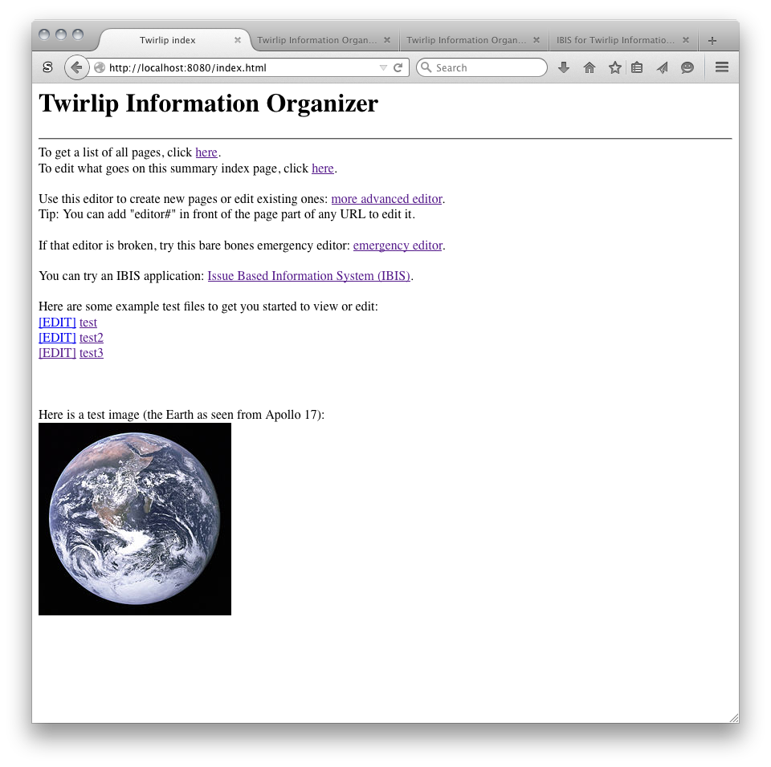
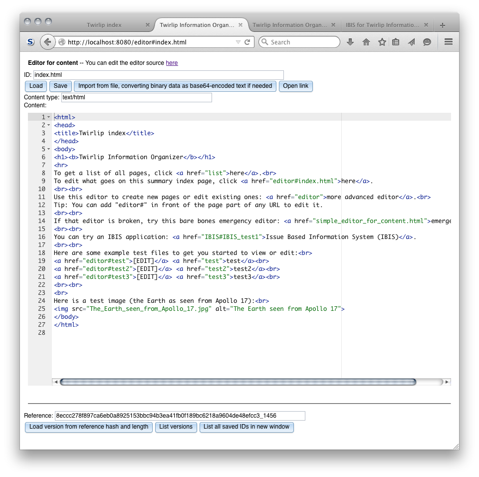
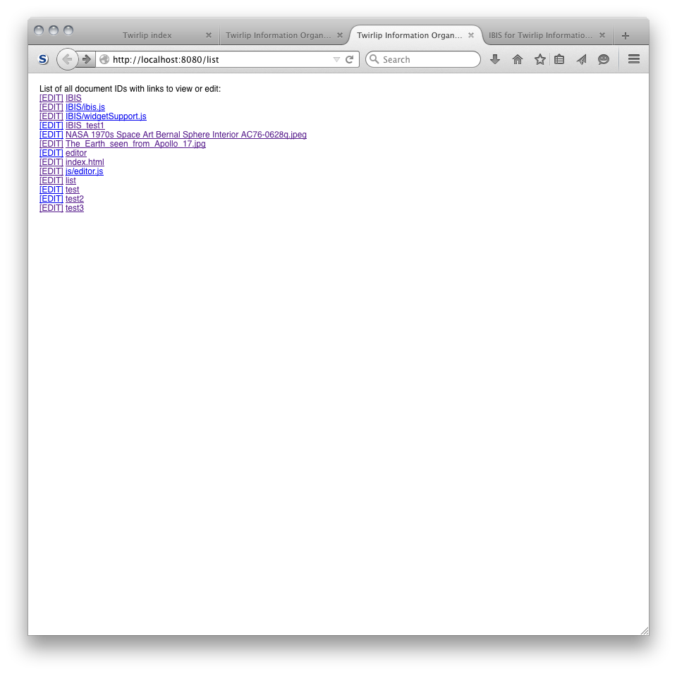
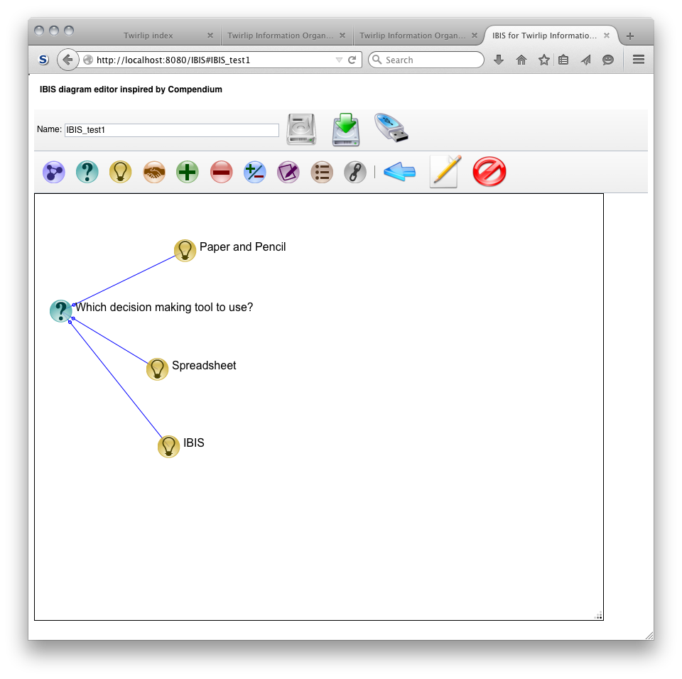

## Twirlip using Pointrel20141201 by Paul Fernhout

This version of Twirlip is essentially a dynamic wiki system.

It uses Pointrel20141201 on NodeJS as a backend to store files in JSON content envelopes.
That server code and instructions for running it are in the "server" directory (essentially, just "node TwirlipServer.js").

There is a default index.html page.
It includes links to two editors, a way to list all pages,
and a simple IBIS diagramming tool inspired by Compendium.

The most basic editor is here:
http://localhost:8080/simple_editor_for_content.html

A more sophisticated editor is here:
http://localhost:8080/editor

As you can edit that editor's source code, you may have to use the simple editor to fix it if you break it for some reason.

A few example resource files are included, mostly just some test text files and a couple free images from NASA.

The license for the base code is MIT licensed.
The resource files may potentially be under other licenses in any expanding system.

Some screenshots;

